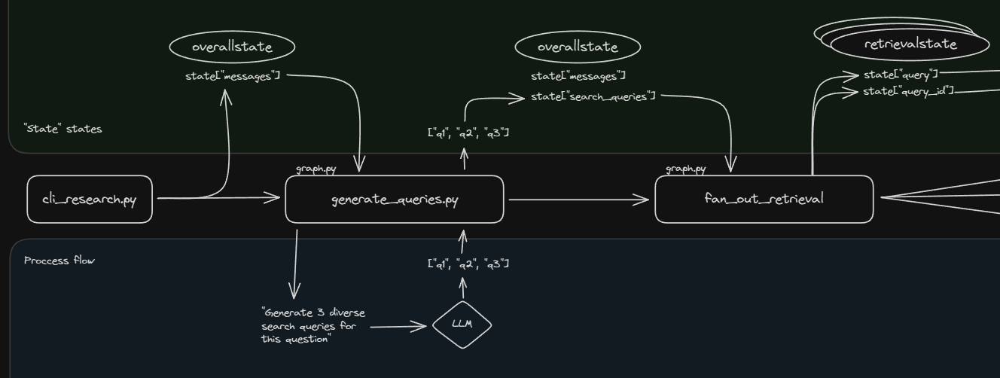
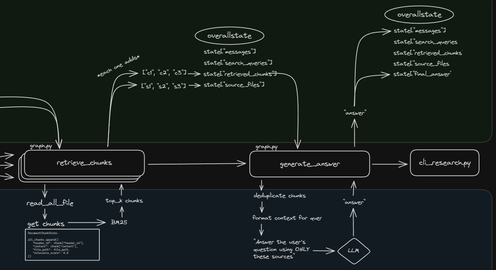
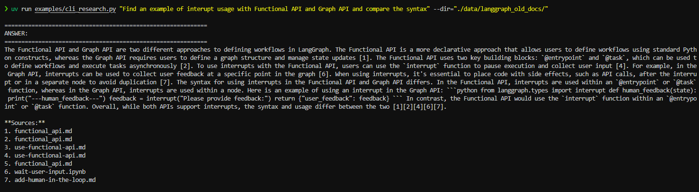

# Local Documentation Search Agent

This project demonstrates a LangGraph-powered agent that performs intelligent search over local documentation using BM25 retrieval. The agent generates optimized search queries, retrieves relevant documentation chunks, and synthesizes comprehensive answers with citations.


## Features

- 💬 Fullstack application with a React frontend and LangGraph backend.
- 🧠 Powered by a LangGraph agent for advanced research and conversational AI.
- 🔍 Dynamic search query generation using X Groq model.
- 📄 Generates answers with citations from gathered sources.
- 🔄 Hot-reloading for both frontend and backend during development.

## Project Structure

The project is divided into two main directories:

-   `frontend/`: Contains the React application built with Vite.
-   `backend/`: Contains the LangGraph/FastAPI application, including the search agent logic.

## Getting Started: Development and Local Testing

Follow these steps to get the application running locally for development and testing.

**1. Prerequisites:**

-   Node.js and npm (or yarn/pnpm)
-   Python 3.11+
-   **`GROQ_API_KEY`**: The backend agent requires a Groq API key.
    1.  Navigate to the `backend/` directory.
    2.  Create a file named `.env` by copying the `backend/.env.example` file.
    3.  Open the `.env` file and add your Groq API key: `GROQ_API_KEY="YOUR_ACTUAL_API_KEY"`

**2. Install Dependencies:**

**Backend:**

```bash
cd backend
pip install .
```

**Frontend:**

```bash
cd frontend
npm install
```

**3. Run Development Servers:**

**Backend & Frontend:**

```bash
make dev
```
This will run the backend and frontend development servers.    Open your browser and navigate to the frontend development server URL (e.g., `http://localhost:5173/app`).

_Alternatively, you can run the backend and frontend development servers separately. For the backend, open a terminal in the `backend/` directory and run `langgraph dev`. The backend API will be available at `http://127.0.0.1:2024`. It will also open a browser window to the LangGraph UI. For the frontend, open a terminal in the `frontend/` directory and run `npm run dev`. The frontend will be available at `http://localhost:5173`._

## How the Backend Agent Works (High-Level)

The agent uses a simplified, efficient architecture optimized for local documentation:
The core of the backend is a LangGraph agent defined in `backend/src/agent/graph.py`. It uses uses a simplified, efficient architecture optimized for local documentation. General flow is as follows:





1. **Generate Queries** - LLM expands user question into 3 diverse search queries
   - Example: "How to setup auth?" → ["authentication configuration", "login setup", "auth credentials"]

2. **Retrieve Chunks (BM25)** - Each query retrieves top-k relevant chunks in parallel

3. **Synthesize Answer** - Single LLM call combines all chunks into coherent answer
   - Includes inline citations [1], [2], etc.

## CLI Example

For quick one-off questions you can execute the agent from the command line. The
script `backend/examples/cli_research.py` runs the LangGraph agent and prints the
final answer:

```bash
cd backend
uv run examples/cli_research.py "Find an example of interupt usage with Functional API and Graph API and compare the syntax" --dir="./data/langgraph_old_docs/"
```

example output:



## Technologies Used

- [React](https://reactjs.org/) (with [Vite](https://vitejs.dev/)) - For the frontend user interface.
- [Tailwind CSS](https://tailwindcss.com/) - For styling.
- [Shadcn UI](https://ui.shadcn.com/) - For components.
- [LangGraph](https://github.com/langchain-ai/langgraph) - For building the backend research agent.
- [Groq](https://www.groq.ai/) - LLM for query generation and answer synthesis.

## License

This project is licensed under the Apache License 2.0. See the [LICENSE](LICENSE) file for details. 
